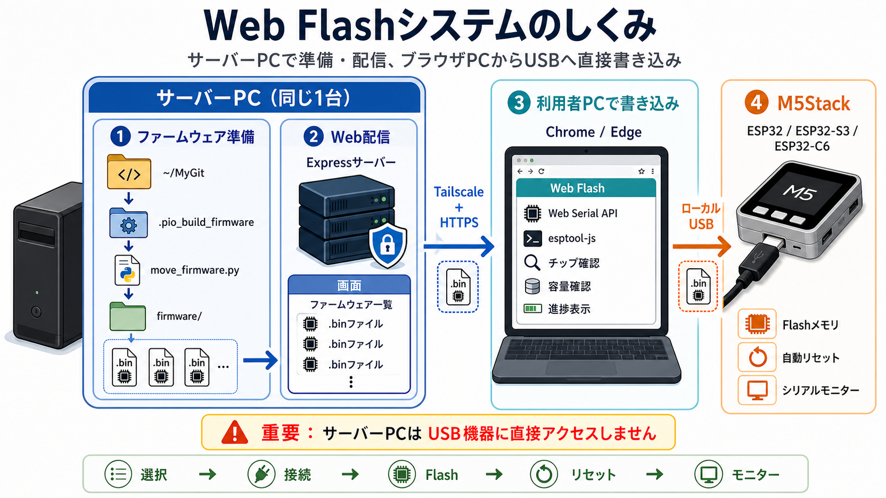

# web_flash_tool

[English](README.en.md) | 日本語

Tailscale経由でアクセスし、ブラウザのWeb Serial API (`esptool-js`) を使って
M5Stack (ESP32 / ESP32-S3) にファームウェアを書き込むためのWebツールです。

`./firmware/` フォルダに置いた `.bin` ファイルを一覧から選び、ブラウザから直接
シリアル経由で書き込みます。書き込み処理はすべてブラウザ内で完結するため、
サーバーはファームウェア一覧の提供と静的ファイルの配信のみを行います。

## システム構成



ファイル名の末尾に書き込みアドレスと容量を `-0x<アドレス>-<バイト数>bytes.bin`
の形式で付加すると、そのアドレスへ書き込みます (例:
`ExampleProject-m5stack-cores3-579568e-20260723-194334-0x10000-6553600bytes.bin`
→ アドレス `0x10000` に書き込み、パーティション容量 `6553600` バイトを超える
場合はエラーにします)。このサフィックスがないファイルはアドレス `0x0`
への書き込みとして扱われます (パーティション容量チェックは行われません)。

## セットアップ

```sh
npm install
npm run build   # web/ を dist/ にビルド
```

## ファームウェア生成側リポジトリの設定

このWebツールの `↻` でビルド成果物を収集するには、`~/MyGit` 配下にある各PlatformIO
リポジトリが、ビルド後のファームウェアをリポジトリ直下の
`.pio_build_firmware/` に出力する必要があります。

このリポジトリに同梱している
[`copy_repository/scripts/copy_firmware.py`](copy_repository/scripts/copy_firmware.py)
を使用します。Webツールのリポジトリで次のコマンドを実行し、対象リポジトリへ
`scripts/copy_firmware.py` をコピーしてください。

```sh
mkdir -p ~/MyGit/<対象リポジトリ>/scripts
cp copy_repository/scripts/copy_firmware.py ~/MyGit/<対象リポジトリ>/scripts/
```

続いて、対象リポジトリの `platformio.ini` にPostスクリプトとして登録します。
全環境で使用する場合は共通の `[env]` セクションへ追加します。

```ini
[env]
extra_scripts =
    post:scripts/copy_firmware.py
```

すでに `extra_scripts` が定義されている場合は、既存のスクリプトを残したまま
次の行を同じリストへ追加してください。

```ini
    post:scripts/copy_firmware.py
```

`copy_firmware.py` は通常のPlatformIOビルド完了後に、アプリ、ファイルシステム、
bootloaderやpartition tableなどの追加イメージをFlashサイズに合わせて1つのbinへ
結合します。生成物は次の形式で `.pio_build_firmware/` にコピーされます。

```text
<リポジトリ名>-<環境名>-<Gitハッシュ>-<日時>-0x0-<Flash容量>bytes.bin
```

例えば `ExampleProject` の `m5stack-cores3` 環境では、次のような名前になります。

```text
ExampleProject-m5stack-cores3-579568e-20260723-194334-0x0-16777216bytes.bin
```

このファイル名に含まれる `0x0` とFlash容量は、Webツールの書き込み先アドレスと
容量チェックに使用されます。その後、Web画面の `↻` を押すと
`move_firmware.py` が各リポジトリの `.pio_build_firmware/` を検索し、生成されたbinを
このWebツールの `firmware/` へ移動します。

このスクリプトはESP32向けPlatformIO環境の `ESP32_APP_OFFSET`、`FS_START`、
`ESP32_FS_IMAGE_NAME`、`FLASH_EXTRA_IMAGES` などを利用します。ファイルシステムを
使用しないプロジェクトや、これらの変数・イメージ構成が異なるプロジェクトでは、
その構成に合わせて `copy_firmware.py` を調整してください。

## 起動

```sh
npm start        # dist/ + API を http://localhost:3000 で配信
```

開発時 (フロントエンドのホットリロードあり):

```sh
npm run dev       # API(3001) + Vite dev server(5173) を同時起動
```

## Web Serial と HTTPS (Tailscale経由でのアクセス)

Web Serial APIはセキュアコンテキスト (HTTPS または `localhost`) でのみ動作します。
Tailscale経由 (`*.ts.net`) でアクセスする場合はHTTPS化が必須です。

Tailscaleの証明書機能を使うと簡単にHTTPS化できます。証明書・鍵は `.secret/`
配下に生成します (このフォルダは `.gitignore` 対象なのでコミットされません)。

```sh
# Tailscale管理画面でHTTPS証明書を有効化した上で実行
cd .secret
tailscale cert --cert-file=<device>.<tailnet>.ts.net.crt --key-file=<device>.<tailnet>.ts.net.key <device>.<tailnet>.ts.net
```

`./web_start.sh` を使うと `tailscale status --json` からホスト名を自動検出し、
`.secret/<device>.<tailnet>.ts.net.{key,crt}` を読み込んで起動します。

```sh
./web_start.sh
```

ホスト名や証明書パスを明示したい場合は環境変数で上書きできます。

```sh
TLS_KEY_PATH=.secret/<device>.<tailnet>.ts.net.key \
TLS_CERT_PATH=.secret/<device>.<tailnet>.ts.net.crt \
PORT=8443 \
npm start
```

ブラウザから `https://<device>.<tailnet>.ts.net:8443` でアクセスしてください。
`TLS_KEY_PATH` / `TLS_CERT_PATH` を指定しない場合はHTTPで起動します
(ローカルの `localhost` アクセスのみWeb Serialが使えます)。

証明書の有効期限は約90日です。期限が切れたら同じコマンドを再実行して更新してください。

## 使い方

1. **デバイス接続 / Connect**: Baud rateを選び、`Connect` を押してブラウザのシリアルポート
   選択ダイアログでM5Stackのポートを選択します。接続時にチップを自動検出し、
   `Board` で選んだ機種に対応するチップ種別と異なる場合は警告します。
2. **ファームウェア選択 / Select firmware**: `./firmware/` 内の `.bin` から書き込む
   ファイルを選びます。`↻` を押すとサーバー側で
   `python3 move_firmware.py ~/MyGit ./firmware` を実行してから一覧を再読み込み
   します (`~/MyGit` 配下の `.pio_build_firmware` フォルダにある新しいビルド成果物
   を `./firmware/` に取り込みます)。取り込み元は `FIRMWARE_SOURCE_DIR` 環境変数で
   変更できます。`Delete All` を押し、確認ダイアログで「はい」を選ぶと、
   `./firmware/` 内のすべての `.bin` を削除します。`Board` では書き込み先の機種 (M5Stack Core2 / M5Stack CoreS3 /
   AtomS3 / AtomS3R / Stamp-S3 / M5Stack Nesso N1 / M5Stack UnitC6L) を選び、機種ごとのFlashサイズを
   書き込み時に指定します。
3. **書き込み / Flash**: 必要なら `Erase flash before write` にチェックを入れ、
   `Flash` を押すと書き込みが始まります。完了後、デバイスは自動的にリセットされます。
4. **シリアルモニター / Serial Monitor**: Baud rateを選んで `Monitor` を押します。
   `切断時に直前のデバイスへ自動再接続` を有効にすると、USB切断後も監視状態を維持し、
   同じデバイスが再接続され次第、ポート選択なしでモニターを再開します。
   再接続待機を終了する場合は `Monitor Disconnect` を押します。

## 対応ボードとFlashサイズ

| Board            | Chip     | Flash size |
| ---------------- | -------- | ---------- |
| M5Stack Core2    | ESP32    | 16MB       |
| M5Stack CoreS3   | ESP32-S3 | 16MB       |
| AtomS3           | ESP32-S3 | 8MB        |
| AtomS3R          | ESP32-S3 | 8MB        |
| Stamp-S3         | ESP32-S3 | 8MB        |
| M5Stack Nesso N1 | ESP32-C6 | 16MB       |
| M5Stack UnitC6L  | ESP32-C6 | 4MB        |

このリストは [`web/src/boards.json`](web/src/boards.json) で管理しています。
ボードを追加・変更する場合はこのファイルを編集し、`npm run build` (または
`npm run dev`) で反映してください。各エントリの `value` は書き込みAPI用の
内部識別子、`chip` は接続時に検出されるチップ名との照合に使われます。

## 注意事項

- 対応ブラウザ: Web Serial APIをサポートするChrome / Edge (バージョン89以降)。
- `firmware/` フォルダの内容はgit管理対象外です (`.gitignore` 参照)。
- 1回の `Flash` 操作につき1ファイルを書き込みます。bootloader / partition-table /
  app / filesystem など複数パーティションに分かれている場合は、各ファイルの
  アドレスサフィックス (`-0x<アドレス>-<バイト数>bytes.bin`) を付けた上で、
  必要な分だけ順番に選択して書き込んでください。

## 謝辞

本ツールの開発にあたり、cinimlさんの
[stackchan-idf](https://github.com/ciniml/stackchan-idf)を参考にしました。
素晴らしいプロジェクトを公開してくださったcinimlさんに感謝します。

## ライセンス

本プロジェクトは [Boost Software License 1.0](LICENSE) の下で公開されています。
